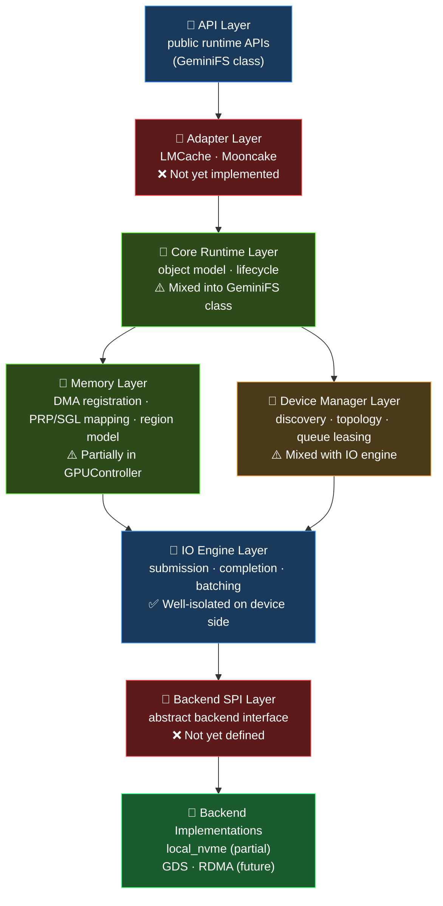
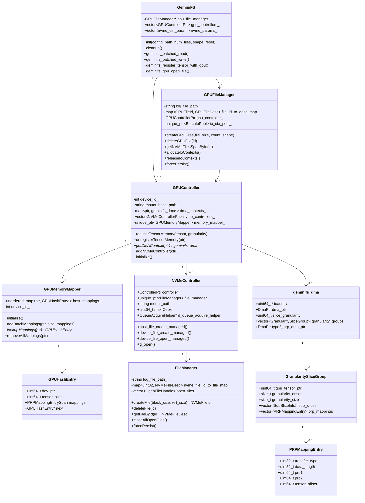
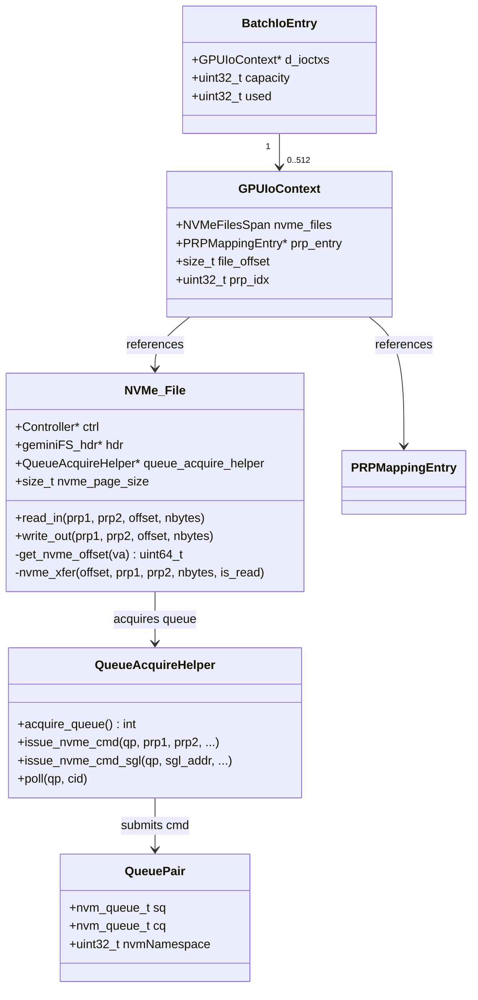
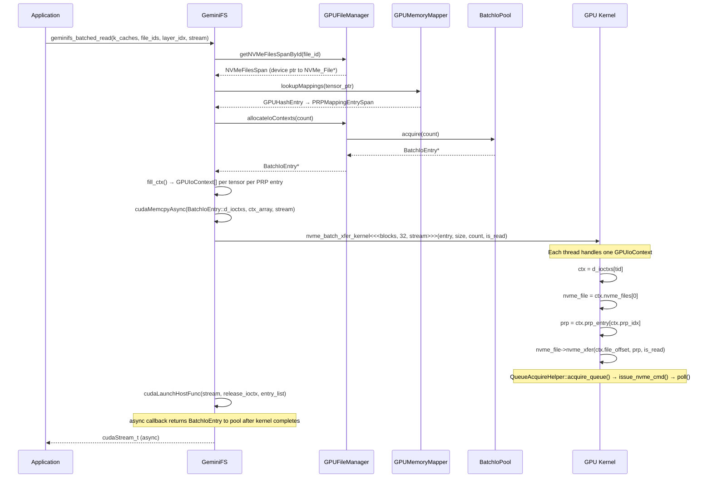
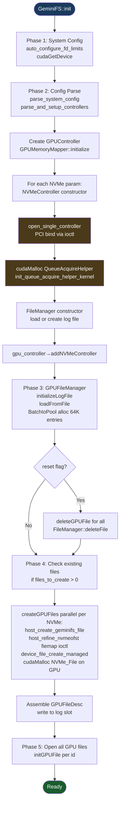
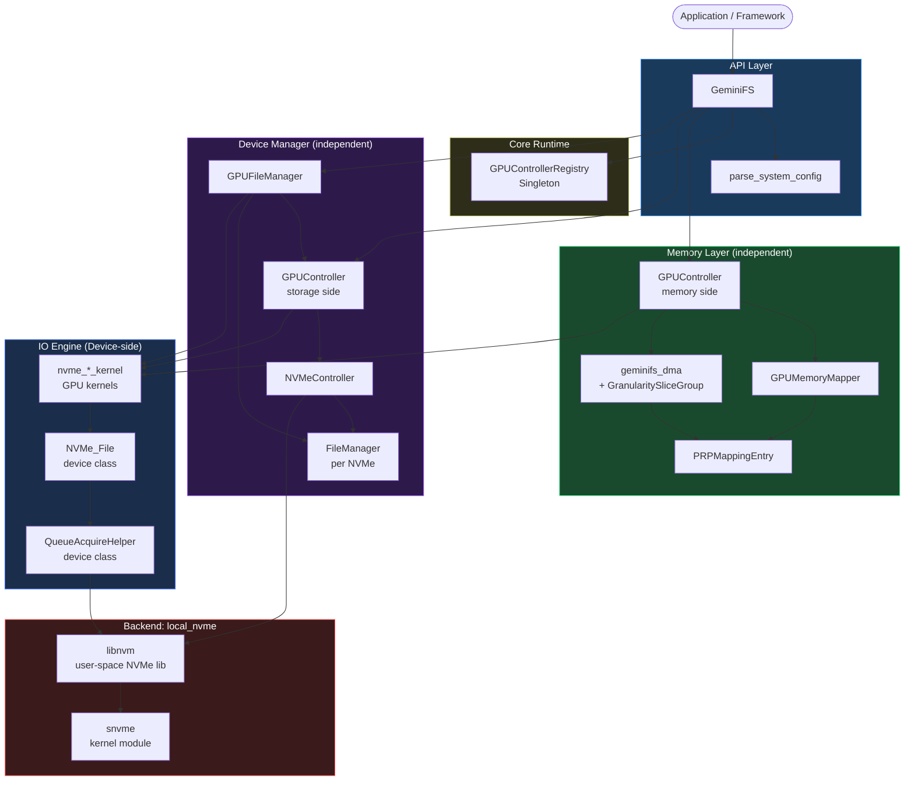
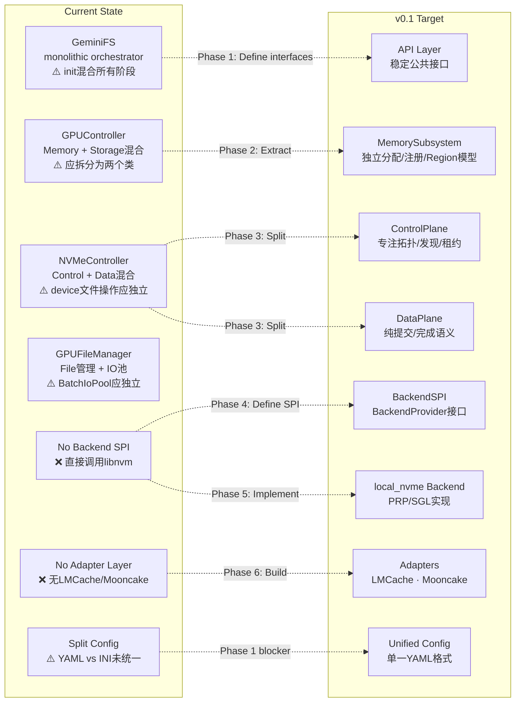

# GeminiFS System Architecture

> **Version**: v0.1 (Refactoring Phase)  
> **Last Updated**: 2026-04-09  
> **Status**: Active — reflects current code with v0.1 target gaps annotated

---

## 1. Overview

GeminiFS is a GPU-oriented Unified Storage Runtime that enables GPU kernels to submit NVMe I/O directly without CPU involvement in the data path. The runtime manages:

- GPU memory registration and DMA mapping
- NVMe controller lifecycle and queue management
- GPU-side file abstraction and batched I/O submission
- Persistent metadata for file and tensor mappings

The current implementation is a **monolithic library** (`libgeminifs`) being refactored into the 8-layer architecture defined in `Roadmap.md`.

---

## 2. Target Architecture

Memory Layer and Device Manager are **independent parallel layers** — memory registration has no dependency on storage topology management, and vice versa. Both feed into IO Engine, which needs registered DMA buffers (from Memory Layer) and acquired NVMe queues (from Device Manager) to submit I/O.



---

## 3. Current Component Map (As-Is)

### 3.1 Class Hierarchy and Ownership



### 3.2 Device-Side (GPU Kernel) Components



---

## 4. Data Flow: Tensor Registration

```mermaid
sequenceDiagram
    participant App as Application
    participant GFS as GeminiFS
    participant GC as GPUController
    participant Mapper as GPUMemoryMapper
    participant NVMe as NVMeController (first)

    App->>GFS: geminifs_register_tensor_with_gpu(tensor, granularity)
    GFS->>GC: registerTensorMemory(tensor, granularity)
    GC->>GC: validateTensor(tensor)
    GC->>GC: createDMAContext(tensor, granularity)
    note over GC: calls libnvm to map GPU pages → DMA bus addresses
    GC->>NVMe: getDeviceDma(ctrl, gpu_ptr, size, device_id)
    NVMe-->>GC: DmaPtr (ioaddrs[])
    GC->>GC: performDMASlicing(dma_ctx, tensor_size, granularity)
    note over GC: Creates GranularitySliceGroup[] with SubSliceInfo[]
    GC->>GC: initializePRPEntries(dma_ctx)
    note over GC: Builds PRPMappingEntry per sub-slice (SINGLE/DUAL/LIST)
    GC->>GC: initializePRPList(dma_ctxs)
    note over GC: cudaMalloc PRP list pages; cudaMemcpy host→device
    GC->>Mapper: addBatchMappings(tensor_ptr, size, prp_entries, gpu_buf)
    note over Mapper: Stores GPUHashEntry with PRPMappingEntrySpan (device pointer)
    Mapper-->>GC: true
    GC-->>GFS: true
    GFS-->>App: success
```

---

## 5. Data Flow: Batched I/O Submission



---

## 6. Initialization Flow



---

## 7. PRP/SGL Memory Mapping Model

```mermaid
graph LR
    T[GPU Tensor\n2GB device memory]

    subgraph DMA["geminifs_dma"]
        IO[ioaddrs[]\nDMA bus addresses\nper 4KB page]
        G0[GranularitySliceGroup 0\ngranularity=256MB]
        G1[GranularitySliceGroup 1\ngranularity=256MB]
        Gn[...]
    end

    subgraph Slices["Sub-slices (per granularity)"]
        S00[SubSlice 0: offset=0, size=128KB]
        S01[SubSlice 1: offset=128KB, size=128KB]
        S0n[...]
    end

    subgraph PRP["PRPMappingEntry (per sub-slice)"]
        P1["SINGLE PAGE\ntransfer_type=0\nprp1=ioaddr[i]\nprp2=0\ndata_length≤4KB"]
        P2["DUAL PAGE\ntransfer_type=1\nprp1=ioaddr[i]\nprp2=ioaddr[i+1]\ndata_length≤8KB"]
        P3["PRP LIST\ntransfer_type=2\nprp1=ioaddr[i]\nprp2=list_page_ioaddr\ndata_length>8KB"]
    end

    subgraph PRPPage["PRP List Page (GPU memory, DMA-mapped)"]
        L1[ioaddr[i+1]]
        L2[ioaddr[i+2]]
        Ln[...]
        LT[type=PRP_TYPE_LIST]
    end

    T --> DMA
    DMA --> Slices
    G0 --> S00
    G0 --> S01
    G0 --> S0n
    S00 --> P1
    S01 --> P2
    S0n --> P3
    P3 --> PRPPage

    style T fill:#1a3a5c,color:#fff
    style PRP fill:#2d4a1a,color:#fff
    style PRPPage fill:#4a2d1a,color:#fff
```

---

## 8. Component Dependency Graph

Memory Layer and Device Manager are independent. The IO Engine depends on both: it needs DMA-mapped PRP entries (Memory Layer) and acquired NVMe queues (Device Manager) to issue I/O.



---

## 9. Refactoring Gap Analysis



---

## 10. Known Constraints and Non-Goals (v0.1)

```mermaid
mindmap
  root((v0.1 Constraints))
    NO Cooperative Submit
      CPU and GPU must not access same queue simultaneously
      Queue-sharing capability ≠ runtime ownership semantics
      Future co-submit needs explicit version decision
    Hardware Requirements
      Linux 5.15.0 only
      NVIDIA H100+ (sm_90)
      CUDA 12.6+
      BIOS: Above4G=ON, IOMMU=OFF
    Kernel Module
      snvme must be installed at system startup
      Not ad-hoc runtime build
      Formal support matrix required
    Config
      YAML (NVMeService) vs INI (libgeminifs)
      Must unify before modularization
    Naming
      Do not hard-code "GeminiFS" in new abstractions
      Runtime name may change in future versions
    GPU File Persistence
      NOT stable in v0.1
      Must not be treated as reliable persistence contract
```

---

## 11. Directory Structure (Current → Target)

```
Current (Historical Boundaries)          Target (v0.1 Direction)
────────────────────────────────         ────────────────────────────────
GeminiFS/                                GeminiFS/
├── backends/local/                      ├── api/                    ← New
│   ├── nvme/libnvm/        ✅           ├── runtime/               ← New
│   ├── kernel_modules/snvme-5.15.0/ ✅   ├── memory/                ← Extract from libgeminifs
│   └── NVMeService/        ✅           ├── device_manager/         ← New
├── filesystems/ext4/                    ├── io_engine/            ← New
│   └── libgeminifs/        ⚠️ Monolith  ├── backends/
│       ├── include/                     │   └── local_nvme/        ← Move from backends/local
│       ├── gpu_controller.cu            ├── adapters/              ← New (LMCache, Mooncake)
│       ├── nvme_controller.cu           ├── doc/architecture/      ← This file
│       ├── gpu_file_manager.cu          ├── examples/
│       ├── geminifs.cu                  └── ...
│       └── ...
├── examples/               ✅
├── doc/
│   └── architecture/       ← This file
└── ...
```

---

*Generated from codebase analysis. Update this document when interfaces change.*
