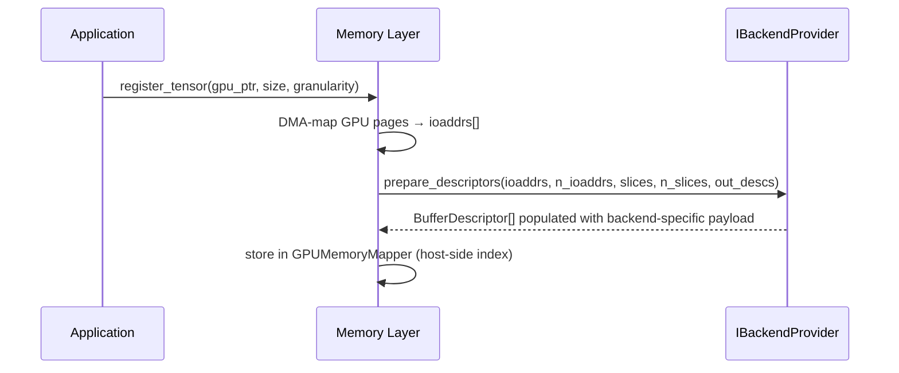
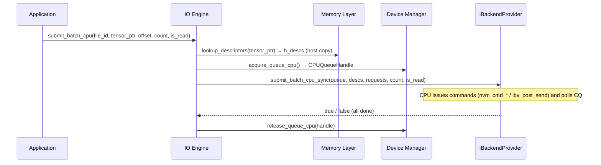
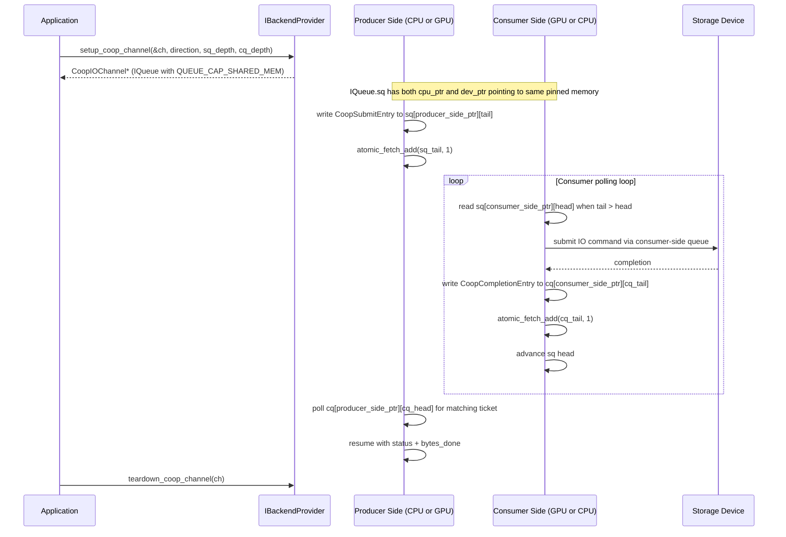

# Backend SPI Design

> **Version**: v0.1 (Draft)
> **Last Updated**: 2026-04-09
> **Status**: Active — binding contract for backend contributors

---

## 1. Purpose

The Backend SPI (Service Provider Interface) is the formal contract between the runtime core and storage backend implementations. It defines exactly what a new backend must implement to plug into the system without modifying upper layers.

A backend is responsible for three things:

- **Memory**: translating DMA-mapped GPU pages into backend-specific buffer descriptors
- **Queue**: managing device queues and making them available for IO submission
- **IO**: launching the actual GPU-side IO operation

The runtime core (Memory Layer, Device Manager, IO Engine) depends only on this SPI. It never calls backend internals directly.

---

## 2. Design Space Boundaries

Before reading the interface, understand what the SPI intentionally does **not** constrain:

| Concern | Who decides | Notes |
|---------|-------------|-------|
| How DMA addresses are obtained | Memory Layer + backend | Backend chooses its descriptor format |
| How queues are allocated | Device Manager + backend | NVMe QP, RDMA QP, or GDS handle — opaque to upper layers |
| Which GPU kernel to launch | Backend's `launch_io_kernel()` | No runtime polymorphism on GPU — see §6 |
| CUDA vs HIP vs SYCL | Backend + IO Engine | v0.1 CUDA only; kernel portability is backend's problem |
| File layout / address translation | Backend | NVMe uses extents+LBA; RDMA uses remote virtual addresses |

---

## 3. Core Types

### 3.1 `BackendType`

```cpp
// io_engine/backend_type.h
enum class BackendType : uint32_t {
    LOCAL_NVME = 0,
    RDMA       = 1,
    GDS        = 2,
    // New backends: add here, do not reorder existing values
};
```

### 3.2 `BufferDescriptor`

The central exchange type between the Memory Layer and the IO Engine. It carries everything the GPU kernel needs to locate the data in device memory, in a backend-neutral wrapper.

```cpp
// io_engine/buffer_descriptor.h

struct NVMeBufferDesc {
    uint64_t prp1;           // Physical Region Page 1 (always valid)
    uint64_t prp2;           // PRP2 or PRP list page IO address (may be 0)
    uint32_t transfer_type;  // PRP_TYPE_SINGLE / DUAL / LIST
    uint32_t data_length;    // Transfer size in bytes
    uint64_t tensor_offset;  // Offset of this slice within the tensor
};

struct RDMABufferDesc {
    uint64_t remote_addr;    // Remote virtual address
    uint64_t local_addr;     // Local GPU buffer address
    uint32_t rkey;           // Remote memory key
    uint32_t lkey;           // Local memory key
    uint32_t data_length;
    uint32_t reserved;
};

struct BufferDescriptor {
    BackendType backend_type;
    uint32_t    reserved;
    union {
        NVMeBufferDesc nvme;
        RDMABufferDesc rdma;
        uint8_t        raw[48];  // Reserved space for future backends
    };
};
```

**Rules for `BufferDescriptor`:**

- Upper layers treat the `union` payload as opaque — they pass it through without reading backend-specific fields.
- The Memory Layer calls `prepare_descriptors()` (§4.1) to populate them.
- The IO Engine passes them to `launch_io_kernel()` (§4.4) unchanged.
- Device-side code reads backend-specific fields directly from the appropriate union member.

### 3.3 `IQueue` — Queue Abstraction Interface

Queues are a first-class extension point. The queue interface is **independent of the backend** so that users can inject their own implementations (e.g., io_uring, custom shared-memory ring, or mock queues for testing) without replacing the entire backend.

Each `IQueue` exposes four optional pointers: the SQ and CQ each have a CPU-accessible pointer and a GPU-accessible pointer. A pointer may be `nullptr` if that side is not supported by the implementation.

```cpp
// io_engine/queue.h

// Capability flags — describes what a particular IQueue instance supports.
enum QueueCap : uint32_t {
    QUEUE_CAP_CPU_ENQUEUE = 1 << 0,  // CPU can write to SQ (CPU-side submit)
    QUEUE_CAP_GPU_ENQUEUE = 1 << 1,  // GPU kernel can write to SQ (GPU-side submit)
    QUEUE_CAP_CPU_POLL    = 1 << 2,  // CPU can read from CQ (CPU-side completion)
    QUEUE_CAP_GPU_POLL    = 1 << 3,  // GPU kernel can read from CQ (GPU-side completion)
    QUEUE_CAP_SHARED_MEM  = 1 << 4,  // SQ/CQ memory is visible to both CPU and GPU
                                      // Required for cooperative submit
};

// Dual-pointer descriptor for one queue ring (SQ or CQ).
// sq_cpu and sq_dev may point to the same pinned memory,
// or to different mappings of the same physical pages.
// Either may be nullptr if that side is unsupported.
struct QueueRingDesc {
    void*    cpu_ptr;   // CPU-accessible pointer to the ring memory
    void*    dev_ptr;   // GPU-accessible pointer to the same (or mapped) ring memory
    uint32_t depth;     // Number of entries in the ring (must be power of 2)
    uint32_t entry_sz;  // Size of one entry in bytes
};

// Full queue descriptor. Obtained from IQueue::desc().
struct QueueDesc {
    QueueRingDesc sq;           // Submission Queue
    QueueRingDesc cq;           // Completion Queue
    uint32_t      queue_index;  // Index within the provider's pool
    uint32_t      capabilities; // Bitmask of QueueCap
};

class IQueue {
public:
    virtual ~IQueue() = default;

    // Descriptor is valid for the lifetime of this IQueue object.
    virtual const QueueDesc& desc() const = 0;

    // CPU-side enqueue: write one or more requests into SQ from the host.
    // Returns number actually enqueued (may be less than count if ring is full).
    // Only valid if capabilities & QUEUE_CAP_CPU_ENQUEUE.
    virtual uint32_t enqueue_cpu(const IORequest* requests, uint32_t count) = 0;

    // CPU-side poll: drain up to max entries from CQ.
    // Returns number of completions written into out[].
    // Only valid if capabilities & QUEUE_CAP_CPU_POLL.
    virtual uint32_t poll_cq_cpu(IOCompletion* out, uint32_t max) = 0;

    // GPU-side operations are handled by GPU kernels via desc().sq.dev_ptr
    // and desc().cq.dev_ptr. No virtual methods here — GPU has no vtable dispatch.
    // The GPU kernel calls backend-private inline device functions to read/write
    // the ring using those raw pointers.
};
```

**Relationship to backends:**
- `IBackendProvider` creates and owns `IQueue` instances via `IQueueProvider` (§3.3.1).
- Users may implement their own `IQueue` and inject it, as long as the `QueueDesc` pointers and `QueueCap` flags are correct.
- `io_uring` backend sketch: `sq.cpu_ptr` = `io_uring_sq` mmap, `sq.dev_ptr` = nullptr (no GPU direct), `capabilities` = `QUEUE_CAP_CPU_ENQUEUE | QUEUE_CAP_CPU_POLL`.

#### 3.3.1 `IQueueProvider` — Queue Factory

Separating queue lifecycle from IO submission allows users to swap queue implementations independently.

```cpp
// io_engine/queue_provider.h

struct QueueConfig {
    uint32_t sq_depth;      // Submission queue depth (power of 2)
    uint32_t cq_depth;      // Completion queue depth (power of 2)
    uint32_t capabilities;  // Required QueueCap bitmask
    int      device_id;     // CUDA device for GPU-visible allocation (-1 = CPU only)
};

class IQueueProvider {
public:
    virtual ~IQueueProvider() = default;

    // Allocate and initialize one queue.
    // Returns nullptr if the requested capabilities cannot be satisfied.
    virtual IQueue* create_queue(const QueueConfig& config) = 0;

    // Release all resources for a queue.
    // The queue must not be in use (all pending IO must have completed).
    virtual void destroy_queue(IQueue* queue) = 0;

    // Number of queues currently allocated.
    virtual uint32_t active_count() const = 0;
};
```

**Rule:** `IBackendProvider` embeds an `IQueueProvider`. Users may replace the default provider at construction time to inject a custom queue implementation (e.g., io_uring, SPDK, or a test double).

### 3.4 `IORequest`

Describes a single IO operation. Backend-agnostic.

```cpp
// io_engine/io_request.h
struct IORequest {
    uint64_t file_offset;    // Logical offset into the target file/region
    uint32_t size;           // Transfer size in bytes
    bool     is_read;
    uint32_t reserved;
    const BufferDescriptor* descriptor;  // Points into device-side descriptor array
};
```

### 3.5 `IOFuture` — Async Completion Token

Used by CPU-async submission paths. The caller submits a batch and receives an `IOFuture`; it can poll or wait for completion without blocking the submission thread.

```cpp
// io_engine/io_future.h
class IOFuture {
public:
    virtual ~IOFuture() = default;

    // Returns true if all IOs in the batch have completed.
    virtual bool is_complete() const = 0;

    // Block until complete or timeout_ms elapses (0 = block indefinitely).
    // Returns true if completed, false if timed out.
    virtual bool wait(uint32_t timeout_ms = 0) = 0;

    // Attempt to cancel pending IOs. Best-effort; already-submitted IOs may complete.
    virtual void cancel() = 0;

    // Number of bytes successfully transferred (available after is_complete() == true).
    virtual uint64_t bytes_transferred() const = 0;
};
```

### 3.6 `CoopIOChannel` — Cooperative Submit Channel

With `IQueue` (§3.3) already providing dual CPU/GPU pointers for SQ and CQ, a cooperative channel is simply an `IQueue` with `QUEUE_CAP_SHARED_MEM` set, plus bookkeeping for the proxy thread.

```cpp
// io_engine/coop_channel.h

// Entry format for the SQ in cooperative mode.
// Must fit within QueueDesc::sq.entry_sz bytes.
struct CoopSubmitEntry {
    IORequest  request;        // What to transfer (offset, size, direction)
    uint64_t   descriptor_idx; // Index into the pre-registered BufferDescriptor array
    uint32_t   ticket;         // Monotonic ID for matching with completion
    uint32_t   reserved;
};

// Entry format for the CQ in cooperative mode.
struct CoopCompletionEntry {
    uint32_t   ticket;     // Matches CoopSubmitEntry::ticket
    uint32_t   status;     // 0 = success; non-zero = backend error code
    uint64_t   bytes_done;
};

// CoopIOChannel wraps an IQueue that has QUEUE_CAP_SHARED_MEM.
// Cooperative direction is NOT fixed:
//   GPU_PRODUCE_CPU_SUBMIT: GPU writes sq.dev_ptr, CPU reads sq.cpu_ptr and submits
//   CPU_PRODUCE_GPU_SUBMIT: CPU writes sq.cpu_ptr, GPU reads sq.dev_ptr and submits
// The direction is a deployment decision; the channel struct is the same either way.
struct CoopIOChannel {
    IQueue*       queue;          // Underlying shared-memory queue (owned by IQueueProvider)
    CoopDirection direction;      // Who produces into SQ and who consumes from it
};

enum class CoopDirection : uint32_t {
    GPU_PRODUCE_CPU_SUBMIT = 0,  // GPU enqueues → CPU proxy submits to device (GPUfs-style)
    CPU_PRODUCE_GPU_SUBMIT = 1,  // CPU enqueues → GPU kernel submits to device (current GeminiFS pattern)
};
```

**Key invariants (implementation responsibility of the backend / queue provider):**
- SQ head/tail counters use `cuda::atomic<uint32_t, thread_scope_system>` in pinned memory
- Producer (either side) advances tail atomically after writing an entry
- Consumer (either side) reads `ring[head % depth]`, processes, then advances head
- CQ follows the same pattern with producer/consumer roles reversed

### 3.7 `IOSubmitMode` — Submission Taxonomy

```cpp
// io_engine/io_submit_mode.h
enum class IOSubmitMode : uint32_t {
    // CPU prepares descriptors; GPU kernel submits commands via device queue doorbell.
    // Completion is CUDA stream-ordered.
    // This is the primary high-throughput path (current GeminiFS default).
    BATCH_GPU_STREAM = 0,

    // CPU prepares descriptors; CPU submits via CPU-side queue; blocks until done.
    BATCH_CPU_SYNC = 1,

    // CPU prepares descriptors; CPU submits via CPU-side queue; returns IOFuture.
    BATCH_CPU_ASYNC = 2,

    // Cooperative: one side writes requests into a shared SQ; the other side
    // submits to the storage device; completions flow back through a shared CQ.
    // Direction is set by CoopIOChannel::direction (§3.6):
    //   GPU_PRODUCE_CPU_SUBMIT — GPU generates requests, CPU submits (GPUfs / FlashNeuron)
    //   CPU_PRODUCE_GPU_SUBMIT — CPU enqueues, GPU submits (alternative; less common)
    // Queue is provided via IQueue with QUEUE_CAP_SHARED_MEM.
    COOP = 3,

    // Fully GPU-driven async (CUDA Graphs / persistent kernel).
    // NOT in scope for v0.1.
    BATCH_GPU_ASYNC = 4,
};
```

---

## 4. Backend SPI Contract

Every backend must implement `IBackendProvider`. This is a host-side C++ interface. GPU kernels are not polymorphic — see §6.

```cpp
// io_engine/backend_provider.h

class IBackendProvider {
public:
    virtual ~IBackendProvider() = default;

    // --- 4.1 Memory Layer interface ---

    /**
     * Translate raw DMA IO addresses into backend-specific BufferDescriptors.
     * Called by the Memory Layer during tensor registration.
     *
     * @param ioaddrs   Array of 4KB-page DMA bus addresses from libnvm/ibverbs/etc.
     * @param n_ioaddrs Number of pages
     * @param slices    Sub-slice layout (offset, size, global_offset) for each descriptor
     * @param n_slices  Number of slices (= number of descriptors to produce)
     * @param out_descs Caller-allocated output array, length n_slices
     * @return true on success
     */
    virtual bool prepare_descriptors(
        const uint64_t*      ioaddrs,
        size_t               n_ioaddrs,
        const SubSliceInfo*  slices,
        size_t               n_slices,
        BufferDescriptor*    out_descs) = 0;

    // --- 4.2 Device Manager interface ---
    //
    // Queues are acquired from the backend's IQueueProvider.
    // The caller receives an IQueue* and inspects its QueueDesc to determine
    // which sides (CPU / GPU) are available and which capabilities are supported.
    //
    // Backends may be constructed with a user-supplied IQueueProvider to
    // allow injection of custom queue implementations (e.g. io_uring, SPDK).

    /**
     * Acquire one queue for an upcoming IO operation.
     * The returned IQueue* is valid until release_queue() is called.
     * Must be thread-safe.
     *
     * @param required_caps  Bitmask of QueueCap the caller needs.
     *                       Returns nullptr if no queue satisfies the request.
     *
     * NVMe default:  returns a QueuePair-backed IQueue with both CPU and GPU
     *                pointers populated (QUEUE_CAP_CPU_ENQUEUE | QUEUE_CAP_GPU_ENQUEUE
     *                | QUEUE_CAP_CPU_POLL | QUEUE_CAP_GPU_POLL).
     * io_uring:      returns an IQueue with CPU pointers only
     *                (QUEUE_CAP_CPU_ENQUEUE | QUEUE_CAP_CPU_POLL).
     */
    virtual IQueue* acquire_queue(uint32_t required_caps) = 0;

    /**
     * Return a queue after IO completes.
     * May be a no-op for stateless pools.
     */
    virtual void release_queue(IQueue* queue) = 0;

    /**
     * Expose the underlying IQueueProvider for introspection or replacement.
     * Returns nullptr if the backend does not support provider injection.
     */
    virtual IQueueProvider* queue_provider() = 0;

    // --- 4.3 Lifecycle ---

    /**
     * Called once after all queues and DMA contexts are ready.
     * Use this to finalize any device-side initialization.
     */
    virtual bool initialize() = 0;

    /**
     * Called during shutdown. Release all device resources.
     */
    virtual void cleanup() = 0;

    // --- 4.4 IO Engine interface ---
    //
    // Four submission modes. Backends must implement BATCH_GPU_STREAM and
    // BATCH_CPU_SYNC for v0.1. BATCH_CPU_ASYNC and COOP_GPU_PRODUCE_CPU_SUBMIT
    // are interface-defined but implementation is optional in v0.1.
    //
    // See §3.7 (IOSubmitMode) for the full taxonomy.

    // ---- Mode 1: BATCH_GPU_STREAM ----------------------------------------
    // CPU prepares descriptors (already in GPU memory via tensor registration).
    // CPU launches a GPU kernel; GPU threads submit IO commands directly to
    // the device queue (NVMe doorbell or GPUDirect RDMA work queue).
    // Completion is CUDA stream-ordered.
    //
    // This is the primary high-throughput path and must be implemented.

    /**
     * Launch the backend's GPU IO kernel on the given CUDA stream.
     * The implementation chooses its own grid/block dimensions.
     * GPU kernels are backend-private; upper layers never call them directly.
     *
     * @param queue       Device-side queue handle (pool pointer for NVMe round-robin,
     *                    or specific slot — backend decides)
     * @param stream      CUDA stream; kernel is ordered within this stream
     * @param d_descs     Device pointer to pre-registered BufferDescriptor array
     * @param d_requests  Device pointer to IORequest array (GPU memory)
     * @param count       Number of IO requests in this batch
     * @param is_read     Direction flag
     */
    virtual void launch_batch_gpu_stream(
        IQueue*                 queue,   // must have QUEUE_CAP_GPU_ENQUEUE | QUEUE_CAP_GPU_POLL
        cudaStream_t            stream,
        const BufferDescriptor* d_descs,
        const IORequest*        d_requests,
        uint32_t                count,
        bool                    is_read) = 0;

    // ---- Mode 2: BATCH_CPU_SYNC ------------------------------------------
    // CPU prepares and submits IO commands directly (no GPU kernel).
    // Blocks until all IOs in the batch complete.
    // Used for initialization, metadata operations, or when GPU is unavailable.

    /**
     * @param queue       CPU-side queue handle from acquire_queue_cpu()
     * @param descs       Host-accessible BufferDescriptor array
     * @param requests    Host-accessible IORequest array
     * @param count       Number of IO requests
     * @param is_read     Direction flag
     * @return true if all IOs completed successfully
     *
     * Backends that do not support CPU_SUBMIT should return false and log.
     */
    virtual bool submit_batch_cpu_sync(
        IQueue*                 queue,   // must have QUEUE_CAP_CPU_ENQUEUE | QUEUE_CAP_CPU_POLL
        const BufferDescriptor* descs,
        const IORequest*        requests,
        uint32_t                count,
        bool                    is_read) = 0;

    // ---- Mode 3: BATCH_CPU_ASYNC -----------------------------------------
    // CPU prepares and submits IO; returns an IOFuture immediately.
    // Caller polls or waits on the future for completion.
    // Useful for overlapping CPU work with IO.

    /**
     * Submit a batch asynchronously from the CPU.
     * Returns an IOFuture* that the caller owns and must delete after use.
     * Returns nullptr if the backend does not support this mode.
     *
     * @param queue       CPU-side queue handle from acquire_queue_cpu()
     * @param descs       Host-accessible BufferDescriptor array (must remain valid
     *                    until future->is_complete() == true)
     * @param requests    Host-accessible IORequest array (same lifetime constraint)
     */
    virtual IOFuture* submit_batch_cpu_async(
        IQueue*                 queue,   // must have QUEUE_CAP_CPU_ENQUEUE | QUEUE_CAP_CPU_POLL
        const BufferDescriptor* descs,
        const IORequest*        requests,
        uint32_t                count,
        bool                    is_read) = 0;

    // ---- Mode 4: COOP_GPU_PRODUCE_CPU_SUBMIT -----------------------------
    // GPU kernel generates IO requests at runtime and enqueues them into a
    // pinned shared ringbuffer. A CPU proxy thread drains the ring and submits
    // commands to the device. CPU writes completions back into a GPU-visible
    // completion ring. GPU kernel polls for completions.
    //
    // Reference: GPUfs (ASPLOS 2013), FlashNeuron (FAST 2021).
    // Use case: dynamic IO patterns where request addresses/offsets are
    // computed by the GPU and cannot be pre-staged by the CPU.

    /**
     * Allocate and initialize a CoopIOChannel.
     * The channel is pinned in host memory and DMA-mapped for GPU access.
     *
     * @param out_channel  Output channel handle; caller owns and must call
     *                     teardown_coop_channel() when done
     * @param submit_depth Submission ring depth (entries, must be power of 2)
     * @param compl_depth  Completion ring depth (entries, must be power of 2)
     * @return true on success
     *
     * Returns false if the backend does not support cooperative submit.
     */
    virtual bool setup_coop_channel(
        CoopIOChannel** out_channel,
        CoopDirection   direction,
        uint32_t        submit_depth,
        uint32_t        compl_depth) = 0;

    /**
     * CPU proxy: drain pending entries from the submission ring and submit them.
     * Should be called in a polling loop on the CPU proxy thread.
     *
     * @param channel     Channel to drain
     * @param max_drain   Maximum entries to process per call (0 = drain all)
     * @return Number of entries submitted this call
     */
    virtual uint32_t drain_coop_channel(
        CoopIOChannel*  channel,
        uint32_t        max_drain = 0) = 0;

    /**
     * Free all resources associated with a CoopIOChannel.
     * Must only be called after the GPU kernel using this channel has completed.
     */
    virtual void teardown_coop_channel(CoopIOChannel* channel) = 0;

    // --- 4.5 Metadata ---

    virtual BackendType   backend_type()    const = 0;
    virtual const char*   backend_name()    const = 0;
    virtual size_t        max_io_size()     const = 0;  // bytes
    virtual size_t        queue_depth()     const = 0;
    virtual size_t        queue_count()     const = 0;
};
```

---

## 5. Layer Interaction Model

### 5.1 Tensor Registration (shared by both submission modes)



### 5.2 Mode 1 — BATCH_GPU_STREAM

CPU pre-stages descriptors; GPU kernel submits commands directly to the device queue (NVMe doorbell or GPUDirect RDMA WR). Completion is CUDA stream-ordered.

```mermaid
sequenceDiagram
    participant App as Application
    participant IOE as IO Engine
    participant Mem as Memory Layer
    participant DM  as Device Manager
    participant SPI as IBackendProvider
    participant Kern as GPU Kernel (backend-private)

    App->>IOE: submit_batch_gpu(file_id, tensor_ptr, offset, count, is_read, stream)
    IOE->>Mem: lookup_descriptors(tensor_ptr) → d_descs (device ptr)
    IOE->>DM: acquire_queue_dev() → DevQueueHandle
    IOE->>SPI: launch_batch_gpu_stream(queue, stream, d_descs, d_requests, count, is_read)
    SPI->>Kern: backend_xfer_kernel<<<...>>>(dev_queue_ptr, d_descs, ...)
    Note over Kern: GPU issues commands directly via doorbell; no virtual dispatch
    Kern-->>SPI: (kernel completes on stream)
    SPI-->>IOE: (returns immediately; stream callback releases resources)
    IOE->>DM: release_queue_dev(handle)
```

### 5.3 Mode 2 — BATCH_CPU_SYNC

CPU prepares and submits; blocking until device completes. No GPU kernel involved.



### 5.4 Mode 3 — BATCH_CPU_ASYNC

CPU submits and returns immediately with an `IOFuture`. Useful for overlapping CPU preparation of the next batch.

```mermaid
sequenceDiagram
    participant App as Application
    participant IOE as IO Engine
    participant DM  as Device Manager
    participant SPI as IBackendProvider

    App->>IOE: submit_batch_cpu_async(...)
    IOE->>DM: acquire_queue_cpu() → CPUQueueHandle
    IOE->>SPI: submit_batch_cpu_async(queue, descs, requests, count, is_read)
    SPI-->>IOE: IOFuture* (caller owns)
    IOE-->>App: IOFuture*
    Note over App: App continues other work...
    App->>IOE: future->wait()
    Note over SPI: Background thread polls device CQ; writes result to future
    SPI-->>App: complete
    IOE->>DM: release_queue_cpu(handle)
```

### 5.5 Mode 4 — COOP (Cooperative Submit)

A shared `IQueue` with `QUEUE_CAP_SHARED_MEM` connects two sides. The `CoopDirection` determines who produces into SQ and who submits to the device. Both directions use the same `IQueue` and `CoopIOChannel` types.

**GPU_PRODUCE_CPU_SUBMIT** (GPUfs / FlashNeuron style):
GPU computes IO addresses at runtime → writes to `sq.dev_ptr` → CPU proxy reads from `sq.cpu_ptr`, submits to device, writes completions to `cq.cpu_ptr` → GPU polls `cq.dev_ptr`.

**CPU_PRODUCE_GPU_SUBMIT** (current GeminiFS conceptual model):
CPU prepares requests → writes to `sq.cpu_ptr` → GPU reads from `sq.dev_ptr` and issues commands via doorbell → GPU writes completions to `cq.dev_ptr` → CPU polls `cq.cpu_ptr`.



Tradeoff vs BATCH_GPU_STREAM: COOP adds one ring-crossing latency (~1–100 µs depending on polling frequency) but enables dynamic IO address generation and works without GPU Direct device queue access.

---

## 6. GPU Dispatch Model

**GPU kernels cannot use virtual dispatch.** There is no vtable mechanism on the GPU. The solution is: the host selects the backend kernel, the GPU executes it directly.

```
DO NOT do this:
  __device__ void submit(IBackendProvider* p, IORequest* r) {
      p->launch(r);  // ❌ pure virtual on GPU — undefined behavior
  }

DO this instead:
  // In IBackendProvider::launch_io_kernel() (host side):
  void LocalNVMeBackend::launch_io_kernel(...) {
      nvme_batch_xfer_kernel<<<blocks, threads, 0, stream>>>(descs, reqs, count, is_read);
  }

  void RDMABackend::launch_io_kernel(...) {
      rdma_xfer_kernel<<<blocks, threads, 0, stream>>>(descs, reqs, count, is_read);
  }
```

**Rule:** Backend polymorphism is resolved on the **host** at kernel launch time. GPU kernels are always concrete, never abstract. Each backend owns its own GPU kernel(s) entirely.

---

## 7. `local_nvme` Reference Mapping

How the current NVMe implementation maps to this SPI:

| SPI Method | Submit Mode | Current Implementation | Location | Status |
|---|---|---|---|---|
| `prepare_descriptors()` | all | `GPUController::initializePRPEntries()` + `doInitializePRPList()` | `gpu_controller.cu` | ⚠️ not yet extracted to SPI |
| `acquire_queue(CPU_ENQUEUE\|CPU_POLL)` | CPU modes | — | — | ❌ not implemented |
| `acquire_queue(GPU_ENQUEUE\|GPU_POLL)` | GPU modes | returns IQueue wrapping `d_qps[]` pool; GPU selects index via `QueueAcquireHelper` | `helper.cuh` | ⚠️ not yet extracted to SPI |
| `release_queue()` | all | no-op for stateless round-robin | — | — |
| `queue_provider()` | all | not yet exposed; NVMeController owns queues directly | `nvme_controller.cu` | ❌ not extracted |
| `initialize()` | all | `init_queue_acquire_helper_kernel` + NVMeController setup | `nvme_controller.cu` | ⚠️ not yet extracted |
| `launch_batch_gpu_stream()` | BATCH_GPU_STREAM | `nvme_batch_xfer_kernel<<<...>>>()` | `gpu_controller.cu` | ✅ implemented, needs SPI wrapper |
| `submit_batch_cpu_sync()` | BATCH_CPU_SYNC | — | — | ❌ not implemented |
| `submit_batch_cpu_async()` | BATCH_CPU_ASYNC | — | — | ❌ not implemented |
| `setup_coop_channel()` | COOP | — | — | ❌ not implemented |
| `drain_coop_channel()` | COOP | — | — | ❌ not implemented |

**Note on `acquire_queue_dev()` for NVMe:** `QueueAcquireHelper::acquire_queue()` resolves the queue index inside the GPU kernel using `(blockDim.x * 32 + threadIdx.x) % nr_queues`. The host-side `acquire_queue_dev()` returns the full `d_qps[]` pool pointer; device-side selection remains. This is valid — the SPI only requires that CPU/device split is explicit, not that index selection happens on the host.

---

## 8. RDMA Backend Sketch

This section is a design sketch for a future contributor. It is not an implementation.

```
backends/rdma/
├── rdma_backend.h            ← RDMABackend : IBackendProvider
├── rdma_backend.cpp          ← prepare_descriptors, acquire_queue, initialize, cleanup
├── rdma_memory_region.h      ← per-tensor ibv_mr registration wrapper
└── rdma_xfer_kernel.cu       ← GPU kernel: issues RDMA work requests (GPUDirect RDMA)
```

RDMA `prepare_descriptors()` sketch:
- Receives `ioaddrs[]` (GPU page DMA addresses)
- Calls `ibv_reg_mr()` to register the GPU memory region with the RDMA NIC
- Fills `RDMABufferDesc{remote_addr, local_addr, rkey, lkey, length}` per slice
- Note: GPUDirect RDMA requires `nv_peer_mem` or `nvidia_peermem` kernel module

RDMA `launch_io_kernel()` sketch:
- Posts RDMA SEND/RECV or RDMA READ/WRITE Work Requests via the QP
- GPU-side kernel issues `ibv_post_send()` equivalent if using GPUDirect RDMA
- Or delegates to CPU-side RDMA verbs with GPU memory as the buffer

---

## 9. How to Add a New Backend

Checklist for a new backend contributor:

```
Step 1: Create backends/<your_backend>/ directory

Step 2: Implement IBackendProvider
  [ ] prepare_descriptors()         — build your BufferDescriptor variant
  [ ] acquire_queue_cpu/dev()       — return your CPU/device queue handles
  [ ] release_queue_cpu/dev()       — return queue slots (no-op if stateless)
  [ ] initialize() / cleanup()      — device setup and teardown
  [ ] launch_batch_gpu_stream()     — launch your __global__ kernel (BATCH_GPU_STREAM)
  [ ] submit_batch_cpu_sync()       — CPU-side synchronous submit (BATCH_CPU_SYNC)
  [ ] submit_batch_cpu_async()      — return IOFuture (may return nullptr if unsupported)
  [ ] setup/drain/teardown_coop_channel() — coop path (may return false if unsupported)

Step 3: Add your BufferDesc struct to BufferDescriptor union in buffer_descriptor.h
  [ ] Add a new BackendType enum value (do not reorder existing values)
  [ ] Add your struct to the union (must fit in 48 bytes raw[])

Step 4: Write your GPU kernel (for BATCH_GPU_STREAM and/or COOP modes)
  [ ] Kernel receives DevQueueHandle.dev_queue_ptr, BufferDescriptor[], IORequest[]
  [ ] Reads your union member (backend_type == YOUR_TYPE guaranteed by host)
  [ ] Issues IO via your protocol (NVMe doorbell, GPUDirect RDMA WR, etc.)
  [ ] GPU kernels are never called by upper layers — only by your launch_batch_gpu_stream()

Step 5: Register your backend with the runtime
  [ ] BackendRegistry::register(your_backend_type, your_factory_fn)

Step 6: Add CMakeLists entry
  [ ] Link your backend sources into the build

Step 7: Write a smoke test in examples/
  [ ] Round-trip read/write for BATCH_GPU_STREAM (minimum)
  [ ] Round-trip for BATCH_CPU_SYNC
  [ ] Cooperative path smoke test if implemented
```

You do **not** need to modify:
- Memory Layer (`memory/`)
- Device Manager (`device_manager/`)
- IO Engine (`io_engine/`)
- API Layer (`api/`)
- Any other backend

---

## 10. v0.1 Constraints

```
✅ IN SCOPE for v0.1
  - This SPI contract (this document is the spec)
  - IOSubmitMode taxonomy defined (§3.7)
  - CPUQueueHandle / DevQueueHandle split defined (§3.3)
  - IOFuture and CoopIOChannel types defined (§3.5, §3.6)
  - local_nvme implements BATCH_GPU_STREAM (launch_batch_gpu_stream)
  - local_nvme implements BATCH_CPU_SYNC (submit_batch_cpu_sync)
  - BufferDescriptor supports NVMe + RDMA placeholder

⚠️ INTERFACE DEFINED BUT IMPLEMENTATION DEFERRED
  - BATCH_CPU_ASYNC (submit_batch_cpu_async / IOFuture)
    → Interface stable; local_nvme may return nullptr in v0.1
  - COOP_GPU_PRODUCE_CPU_SUBMIT (setup/drain/teardown_coop_channel)
    → Interface stable; local_nvme may return false in v0.1
    → Full implementation is a separate workstream (requires CPU proxy thread)

❌ OUT OF SCOPE for v0.1
  - RDMA backend implementation
  - GDS backend implementation
  - HIP / non-CUDA GPU support
  - Dynamic backend loading at runtime (no dlopen)
  - BATCH_GPU_ASYNC (persistent kernel / CUDA Graphs driven IO)

⚠️ KNOWN COUPLING in v0.1
  - launch_batch_gpu_stream() takes cudaStream_t — CUDA-only signature
    Future: abstract StreamHandle<T> when HIP support is needed
  - GPU kernels use CUDA thread model (blockDim.x, threadIdx.x)
    Future: HIP compatibility layer or compile-time abstraction
  - CoopIOChannel uses cuda::atomic<uint32_t, thread_scope_system>
    Future: replace with portable atomic when non-CUDA support is needed
  - queue_ptr fields are void* — backend-specific type safety deferred to v0.2
```

---

## 11. Open Questions (to be resolved before v0.1 freeze)

- [ ] 48-byte `raw[]` in `BufferDescriptor` — is this large enough for all foreseeable backends? (NVMe needs 32B, RDMA needs 28B currently)
- [ ] `IORequest.file_offset` semantics for RDMA — is it a local file offset or a remote virtual address? May need a union or rename.
- [ ] `BackendRegistry` singleton vs explicit wiring through GPUController constructor?
- [ ] For `acquire_queue_dev()`: pool-return (device selects index, current NVMe) vs per-call slot (RDMA needs specific QP). SPI currently allows both — document the contract per backend.
- [ ] `CoopIOChannel` submit ring entry size — `CoopSubmitEntry` currently 64B. Is that enough for all backends, or should it be variable?
- [ ] CPU proxy thread model for COOP mode: dedicated thread per channel, shared thread pool, or caller's event loop? Backend decides, but the SPI should say who owns the thread.
- [ ] Should `IOFuture` support chaining (future A completes → triggers future B) for pipelined IO? Defer to v0.2 unless a backend needs it.

---

*This document is the authoritative contract for backend contributors. Update it when any SPI method changes signature or semantics.*
